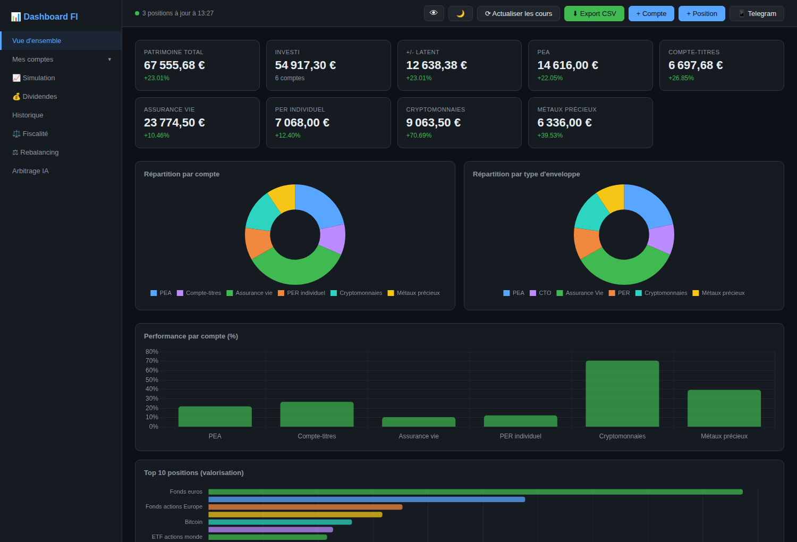

# Dashboard FI

Tableau de bord d'investissement auto-hébergé : vous créez vos propres comptes (PEA,
compte-titres, PER, assurance vie, métaux précieux, cryptomonnaies), y saisissez vos
positions, et le dashboard suit les cours en direct, l'historique de valorisation, les
dividendes, la fiscalité et le rééquilibrage.

Le projet ne contient **aucune donnée de portefeuille** : la base est vide au premier
lancement et tout reste sur votre machine.



## Sommaire

- [Fonctionnalités](#fonctionnalités)
- [Types de comptes](#types-de-comptes)
- [Installation](#installation)
- [Premiers pas](#premiers-pas)
- [Cours automatiques](#cours-automatiques)
- [Options](#options) — clé IA, authentification, Telegram
- [HTTPS](#https)
- [Déploiement permanent](#déploiement-permanent-debian)
- [API](#api)
- [Structure du projet](#structure-du-projet)

## Fonctionnalités

| Onglet | Contenu |
|---|---|
| **Vue d'ensemble** | Patrimoine total, variation 24 h, alertes, calendrier fiscal, répartition par compte et par type d'enveloppe, performance, top 10 des positions, faits marquants, répartition sectorielle et géographique |
| **Mes comptes** | Création, modification et suppression des comptes ; une page par compte avec le détail des positions |
| **Mouvements** | Journal des achats, ventes, versements, retraits et frais ; prix moyen pondéré et plus-values réalisées qui en découlent |
| **Simulation** | Projection patrimoniale (horizon, rendement, versements mensuels, inflation, scénarios haussier/baissier) |
| **Dividendes** | Saisie des versements, revenus par mois et par année, top positions, TRI (XIRR) par ligne |
| **Historique** | Évolution du patrimoine total et par compte, en euros ou en base 100 (TWR), comparée à des indices reconvertis en euros |
| **Fiscalité** | Règles et simulateur de sortie adaptés au type de chaque compte et à sa date d'ouverture |
| **Rebalancing** | Allocation cible par compte, écarts, et mouvements d'achat/allègement recommandés |
| **Arbitrage IA** | Analyse du portefeuille par l'API Anthropic (optionnel, clé requise) |

Également : thème clair/sombre, masquage des montants, export CSV, application installable
(PWA) utilisable hors ligne, et interface responsive jusqu'au format mobile.

### Journal des mouvements

Le dashboard fonctionne sans journal : on peut saisir une position à la main et suivre sa
valorisation. Mais trois mesures resteront alors hors d'atteinte, parce qu'une photo du
portefeuille ne sait pas distinguer un gain d'un apport.

| Mouvement | Porte sur | Effet |
|---|---|---|
| **Achat** | une position | Alimente le PMP et fige le prix de revient en euros |
| **Vente** | une position | Sort une quote-part du prix de revient et constate la plus-value réalisée |
| **Versement** / **Retrait** | l'enveloppe | Date un flux, sans toucher au prix de revient d'une ligne |
| **Frais** | l'enveloppe | Date une sortie d'argent |

Dès qu'un achat est enregistré sur une position, sa quantité, son PRU et son prix de revient
sont recalculés depuis le journal et ne se saisissent plus à la main. Un achat représentant
déjà l'argent qui entre, ne doublez pas l'écriture avec un versement pour la même somme :
le versement sert aux enveloppes dont vous ne détaillez pas les lignes.

Ce que le journal débloque :

- **TWR** (rendement pondéré par le temps) — les rendements sont chaînés entre chaque flux,
  ce qui neutralise les versements. C'est la seule mesure comparable à un indice : sans
  elle, verser 500 €/mois sur un portefeuille de 50 000 € le fait « battre » un indice
  stable de 12 % sans qu'aucun actif n'ait progressé. Bascule *Base 100* dans l'Historique.
- **TRI** (XIRR) — le rendement de l'investisseur, daté sur ses versements réels. Il est
  désormais refusé plutôt qu'estimé lorsqu'aucun mouvement n'est enregistré.
- **Plus-value réalisée** — la seule qui soit imposable, séparée de la plus-value latente.

Le prix de revient en euros est **figé au jour de l'achat** et jamais recalculé au taux du
moment. Sur une ligne en devise, la différence n'est pas anecdotique : 100 titres achetés
300 $ quand l'euro valait 1,20 $ ont coûté 25 000 €, pas les 28 571 € qu'un recalcul au
taux du jour ferait apparaître — soit 19 points de performance escamotés.

### Alertes et calendrier fiscal

La vue d'ensemble signale ce qui demande une décision, à partir des seules données déjà
saisies :

| Alerte | Déclenchement |
|---|---|
| Cap fiscal | 90 jours avant et après le seuil du compte (5 ans PEA, 8 ans assurance vie, 22 ans métaux), daté à partir de la date d'ouverture |
| Dérive d'allocation | Écart d'au moins 5 points entre l'allocation réelle et la cible du rebalancing |
| Taux de change non confirmé | Position en devise étrangère encore valorisée 1:1 avec l'euro, faute de taux récupéré |
| Ticker muet | Aucun cours jamais récupéré — le plus souvent une faute de frappe dans le ticker |
| Cours figé | Dernier cours obtenu il y a plus de 5 jours : titre suspendu, radié ou ticker devenu invalide |
| Forte moins-value | Ligne à −20 % ou moins de plus-value latente |

Le calendrier fiscal affiche pour chaque enveloppe à seuil la date exacte du cap et la
progression vers celle-ci. Les versements n'étant pas enregistrés, le plafond du PEA n'est
en revanche pas contrôlé.

## Types de comptes

Chaque compte que vous créez porte un type. Celui-ci détermine l'unité des quantités, la
devise proposée par défaut et surtout les règles appliquées dans l'onglet Fiscalité.

| Type | Unité | Seuil de détention | Simulateur de sortie |
|---|---|---|---|
| **PEA** | titres | 5 ans | Exonération d'IR après 5 ans, prélèvements sociaux à 17,2 % ; flat tax et clôture avant |
| **CTO** | titres | — | Flat tax de 30 % (12,8 % IR + 17,2 % PS) |
| **PER** | parts | — | Barème de l'IR sur les versements déduits, 30 % sur la quote-part de gains |
| **Assurance vie** | parts | 8 ans | Abattement de 4 600 € / 9 200 €, IR réduit à 7,5 %, comparé au régime d'avant 8 ans |
| **Métaux précieux** | onces | 22 ans | Taxe forfaitaire de 11,5 % comparée au régime des plus-values (36,2 % avec abattement) |
| **Cryptomonnaies** | unités | — | Flat tax de 30 %, exonération sous 305 € de cessions annuelles |

Les taux sont regroupés dans [`catalog.py`](catalog.py) — un seul fichier à mettre à jour
si la législation change. Ces simulations sont indicatives et ne remplacent pas l'avis
d'un conseiller fiscal.

## Installation

Prérequis : Python 3.9 ou plus récent.

```bash
git clone https://github.com/zebulon94fr/Dashboard-FI-pub.git
cd Dashboard-FI-pub

python3 -m venv .venv
source .venv/bin/activate        # Windows : .venv\Scripts\activate

pip install -r requirements.txt
python app.py
```

Le dashboard est accessible sur [http://localhost:8742](http://localhost:8742). La base
SQLite (`dashboard.db`) est créée automatiquement au premier lancement.

Variables d'environnement :

| Variable | Défaut | Description |
|---|---|---|
| `DASHBOARD_PORT` | `8742` | Port d'écoute |
| `DASHBOARD_HOST` | `0.0.0.0` | Interface d'écoute |
| `DASHBOARD_DB` | `./dashboard.db` | Emplacement de la base SQLite |
| `DASHBOARD_SSL_CERT` | — | Certificat TLS (voir [HTTPS](#https)) |
| `DASHBOARD_SSL_KEY` | — | Clé privée TLS |
| `DASHBOARD_WORKERS` | `2` | Processus gunicorn (déploiement en service) |

En déploiement systemd, ces variables se règlent dans `/etc/default/dashboard-fi` plutôt
qu'à la ligne de commande — voir [Déploiement permanent](#déploiement-permanent-debian).

## Premiers pas

1. **Créez un compte** via le bouton `+ Compte` : choisissez le type d'enveloppe, donnez-lui
   un nom, et renseignez la date d'ouverture (elle sert aux règles fiscales liées à la durée
   de détention).
2. **Ajoutez vos positions** avec `+ Position`. Renseignez le ticker Yahoo Finance pour que
   le cours se mette à jour tout seul ; sans ticker, le cours reste celui que vous saisissez.
3. **Actualisez les cours** — l'historique se construit à partir de là, un point par
   actualisation et un point de clôture par jour.

Pour voir l'interface remplie avant d'y saisir vos vraies données :

```bash
python scripts/demo_data.py           # portefeuille fictif de 6 comptes
python scripts/demo_data.py --reset   # repartir d'une base vide
```

## Cours automatiques

Les cours viennent de Yahoo Finance via [yfinance](https://github.com/ranaroussi/yfinance).
Le ticker se trouve sur [finance.yahoo.com](https://finance.yahoo.com) — par exemple
`BN.PA` (Danone), `MSFT` (Microsoft), `BTC-EUR` (Bitcoin), `GC=F` (once d'or).

Le moteur est identique pour toutes les enveloppes : le cours est récupéré dans la devise
de la position, puis converti en euros au taux du moment. Les valorisations, plus-values et
totaux sont donc toujours en euros, tandis que cours et PRU restent affichés dans leur
devise d'origine.

Deux garde-fous s'appliquent à chaque actualisation :

- **Aucune devise n'est valorisée 1:1 par défaut.** Si le taux d'une devise est inconnu, il
  est cherché sur le marché ; à défaut, l'écriture est refusée avec un message explicite
  plutôt que de valoriser un dollar comme un euro sans que rien ne le signale.
- **Les divisions de titres sont détectées.** Un décrochage de plus de 35 % en une
  actualisation déclenche une vérification auprès de Yahoo : si un split est confirmé, la
  quantité et le PRU de la position — ainsi que les mouvements de son journal — sont ajustés
  du ratio exact. Sinon le cours est enregistré tel quel : c'est un vrai mouvement de marché.

Les listes de tickers crypto et métaux sont proposées en autocomplétion, mais n'importe
quel ticker Yahoo reste utilisable.

## Options

### Analyse IA

L'onglet *Arbitrage IA* utilise l'API Anthropic. Renseignez votre clé directement dans
l'interface, ou dans `settings.json` :

```bash
cp settings.json.example settings.json
```

```json
{ "anthropicKey": "sk-ant-..." }
```

`settings.json` est ignoré par git : la clé ne quitte pas votre machine. Sans clé, tout le
reste du dashboard fonctionne normalement.

### Authentification

Par défaut, il n'y a pas de mot de passe — pratique en local. Si le serveur est joignable
depuis d'autres appareils, activez une authentification HTTP Basic :

```bash
python scripts/set_password.py             # activer / modifier
python scripts/set_password.py --disable   # désactiver
```

Seul le hash du mot de passe est stocké dans `settings.json`. Les appels venant de
`127.0.0.1` (par exemple le timer de rafraîchissement) ne sont jamais bloqués.

### Résumé Telegram

Envoie un résumé du portefeuille (répartition, performance, meilleures et pires positions,
et une analyse IA si une clé est configurée) sur Telegram, à la demande via le bouton
**📱 Telegram** ou automatiquement via un timer systemd.

```bash
python scripts/set_telegram.py
```

Le script explique comment créer un bot via `@BotFather` et récupérer votre `chat_id`.

## HTTPS

```bash
./scripts/generate_cert.sh                 # localhost uniquement
./scripts/generate_cert.sh 192.168.1.50    # + accessible depuis le réseau local
DASHBOARD_SSL_CERT=certs/cert.pem DASHBOARD_SSL_KEY=certs/key.pem python app.py
```

Le certificat étant auto-signé, le navigateur affiche un avertissement la première fois.

## Déploiement permanent (Debian)

Le dashboard tourne comme service systemd : il démarre au boot du serveur, redémarre seul
après un crash, et n'a besoin d'aucune session ouverte.

```bash
sudo mkdir -p /opt/dashboard-fi && sudo chown $USER /opt/dashboard-fi
git clone https://github.com/zebulon94fr/Dashboard-FI-pub.git /opt/dashboard-fi
cd /opt/dashboard-fi

sudo ./scripts/install_service.sh
```

Le script est idempotent — relancez-le après chaque `git pull`. Il crée l'utilisateur
système `dashboard`, installe les dépendances dans `.venv`, écrit la configuration dans
`/etc/default/dashboard-fi`, installe les unités systemd puis active et démarre le service.
Les chemins des unités sont réécrits à la volée : rien à modifier si vous installez
ailleurs que dans `/opt/dashboard-fi`.

Options :

```bash
sudo ./scripts/install_service.sh --no-timers      # service seul, sans tâches planifiées
sudo ./scripts/install_service.sh --with-telegram  # + résumé Telegram hebdomadaire
sudo DASHBOARD_USER=finance ./scripts/install_service.sh   # autre utilisateur système
```

### Configuration

Port, base de données et HTTPS se règlent dans `/etc/default/dashboard-fi`, sans jamais
toucher aux unités :

```bash
sudo nano /etc/default/dashboard-fi
sudo systemctl restart dashboard-fi
```

Pour activer HTTPS : générez le certificat, décommentez les deux lignes `DASHBOARD_SSL_*`
et passez `DASHBOARD_SCHEME` à `https`.

```bash
sudo -u dashboard ./scripts/generate_cert.sh 192.168.1.50
```

Si le certificat est déclaré mais illisible, le service refuse de démarrer plutôt que de
servir en clair sans prévenir.

### Tâches planifiées

Elles sont installées avec le service et survivent au redémarrage. `Persistent=true`
rattrape l'exécution manquée si le serveur était éteint à l'heure prévue.

| Timer | Rôle | Fréquence |
|---|---|---|
| `dashboard-fi-refresh.timer` | Actualise les cours sans ouvrir le dashboard | toutes les heures |
| `dashboard-fi-backup.timer` | Sauvegarde la base dans `backups/` | quotidienne, rétention 14 jours |
| `dashboard-fi-telegram.timer` | Envoie le résumé Telegram | samedi 9 h (option `--with-telegram`) |

### Exploitation

```bash
systemctl status dashboard-fi              # état du service
journalctl -u dashboard-fi -f              # logs en direct
systemctl restart dashboard-fi             # après modification de la configuration
systemctl list-timers 'dashboard-fi*'      # prochaines exécutions planifiées
systemctl start dashboard-fi-backup        # déclencher une sauvegarde immédiatement
```

Si un pare-feu est actif :

```bash
sudo ufw allow 8742/tcp
```

### Ce que fait l'unité

- `Restart=always` avec 5 s d'attente : le service revient après un crash comme après un
  arrêt propre du processus. Au-delà de 5 échecs en 5 minutes, systemd cesse d'insister —
  c'est le signe d'une erreur de configuration, pas d'une panne passagère.
- `WantedBy=multi-user.target` : démarrage automatique au boot.
- `After=network-online.target` : le réseau est disponible avant la première requête de cours.
- Durcissement : `ProtectSystem=strict` et `ReadWritePaths` limitent l'écriture au seul
  répertoire d'installation ; `NoNewPrivileges`, `PrivateTmp` et `ProtectHome` réduisent la
  surface d'attaque d'un service qui expose des données financières.

`ProtectHome=true` bloque l'accès à `/home` : si vous installez sous `/home/<utilisateur>`
plutôt que dans `/opt`, retirez cette ligne de `deploy/dashboard-fi.service` avant
d'installer.

## API

Toutes les routes sont sous `/api`. Le frontend n'utilise rien d'autre — un script ou un
autre client peut donc piloter le dashboard de la même façon.

| Méthode | Route | Description |
|---|---|---|
| `GET` | `/api/account-types` | Catalogue des types d'enveloppes et de leurs règles |
| `GET` | `/api/data` | Portefeuille complet : comptes, positions, historique |
| `GET` `POST` | `/api/accounts` | Liste et création de comptes |
| `PUT` `DELETE` | `/api/accounts/<id>` | Modification et suppression (positions et dividendes en cascade) |
| `POST` | `/api/accounts/cibles` | Allocations cibles du rebalancing |
| `GET` `POST` | `/api/accounts/<id>/positions` | Positions d'un compte |
| `PUT` `DELETE` | `/api/positions/<id>` | Modification, déplacement vers un autre compte, suppression |
| `GET` | `/api/quotes` | Actualise cours et taux de change |
| `GET` | `/api/stats` | Agrégats, meilleures et pires positions, variation 24 h, journées extrêmes, cours périmés |
| `GET` `POST` | `/api/dividendes` | Versements enregistrés |
| `PUT` `DELETE` | `/api/dividendes/<id>` | Modification et suppression |
| `GET` | `/api/transaction-types` | Types de mouvement acceptés par le journal |
| `GET` `POST` | `/api/transactions` | Journal des mouvements (filtres : compte, position, type, année) |
| `PUT` `DELETE` | `/api/transactions/<id>` | Modification et suppression, avec recalcul du PMP |
| `GET` | `/api/plus-values` | Plus-values réalisées reconstituées depuis le journal |
| `GET` | `/api/performance?days=` | TWR en base 100 et TRI du portefeuille |
| `GET` | `/api/tri?nom=&account_id=` | TRI d'une position, calculé sur ses flux datés |
| `GET` | `/api/benchmark?days=` | Indices reconvertis en euros, en base 100 et en valeur |
| `GET` | `/api/export/csv` | Export du portefeuille |
| `POST` | `/api/telegram/send` | Envoi du résumé |

Les erreurs de validation renvoient `400` avec un message en français dans `{"error": …}`.

## Structure du projet

```
Dashboard-FI-pub/
├── app.py                  # Point d'entrée Flask (+ auth HTTP Basic optionnelle)
├── config.py               # Chemins et configuration
├── catalog.py              # Types d'enveloppes, règles fiscales, tickers de référence
├── backend/                # Logique métier
│   ├── accounts.py            # CRUD des comptes
│   ├── positions.py           # CRUD des positions, calculs, historique
│   ├── transactions.py        # Journal, prix moyen pondéré, plus-values réalisées
│   ├── performance.py         # Flux datés, TWR et TRI (XIRR)
│   ├── quotes.py              # Cours, taux de change et divisions de titres (yfinance)
│   ├── stats.py               # Agrégats
│   ├── dividendes.py          # Dividendes encaissés
│   ├── benchmark.py           # Indices de comparaison, reconvertis en euros
│   ├── export.py              # Export CSV
│   ├── telegram.py            # Résumé Telegram
│   ├── claude.py              # Appel à l'API Anthropic
│   ├── settings.py            # settings.json
│   └── db.py                  # Connexion SQLite et schéma
├── routes/                 # Un blueprint Flask par domaine d'API
├── static/                 # Frontend (HTML + CSS + modules ES natifs)
│   ├── js/                    # Un module par onglet, api.js centralise le réseau
│   ├── vendor/                # Chart.js servi localement (MIT)
│   ├── manifest.json          # PWA
│   └── sw.js                  # Service worker : cache le shell, jamais /api
├── scripts/                # Exploitation
│   ├── install_service.sh     # Installation en service systemd (idempotent)
│   ├── run_server.sh          # Lancement gunicorn, TLS optionnel — ExecStart de l'unité
│   ├── backup_db.py           # Sauvegarde cohérente + purge, sans dépendance externe
│   ├── refresh_quotes.sh      # Actualisation des cours en local
│   ├── send_telegram_summary.sh
│   ├── generate_cert.sh       # Certificat TLS auto-signé
│   ├── set_password.py        # Authentification HTTP Basic
│   ├── set_telegram.py        # Bot et chat_id Telegram
│   └── demo_data.py           # Portefeuille de démonstration
├── deploy/                 # Unités systemd + modèle de /etc/default/dashboard-fi
├── dashboard.db            # Base SQLite (non versionnée, créée au lancement)
├── backups/                # Sauvegardes quotidiennes (non versionné)
└── settings.json           # Clé API, identifiants, Telegram (non versionné)
```

### Modèle de données

Aucune enveloppe n'est câblée dans le schéma : un compte est une ligne de `accounts`, et
positions, historique et dividendes s'y rattachent par `account_id`. Ajouter un type
d'enveloppe se fait donc dans `catalog.py`, sans migration.

```
accounts ──┬── positions ──── price_history
           ├── transactions ──── (position_id : achats et ventes)
           ├── dividendes
           └── history_daily / history_intraday   (account_id = 0 : total du portefeuille)
```

`transactions` est la source de vérité des positions qui en ont une : `quantite`, `pru` et
`cout_eur` en sont dérivés à chaque écriture. Une position sans mouvement garde sa saisie
manuelle, et son prix de revient reste estimé au taux du moment (`cout_eur` à NULL).

## Vie privée

Tout est local : la base SQLite, les identifiants et la clé API restent sur votre machine et
sont exclus du dépôt par `.gitignore`. Le dashboard ne contacte l'extérieur que pour
récupérer les cours (Yahoo Finance), et — si vous les configurez — l'API Anthropic et
Telegram. Chart.js est servi depuis `static/vendor/` plutôt qu'un CDN : aucune requête
tierce au chargement de la page.
